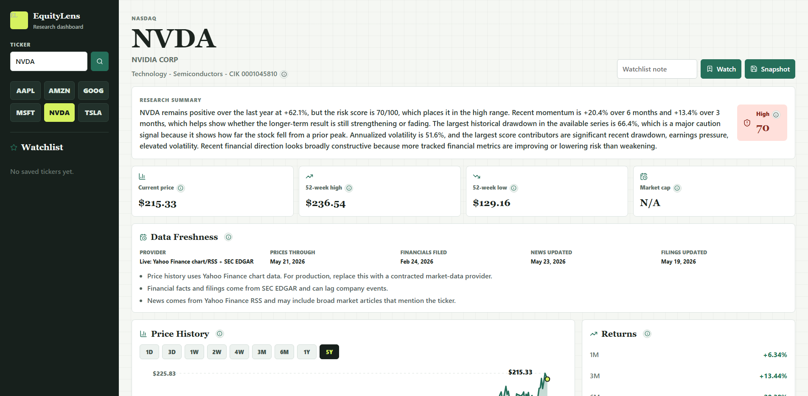
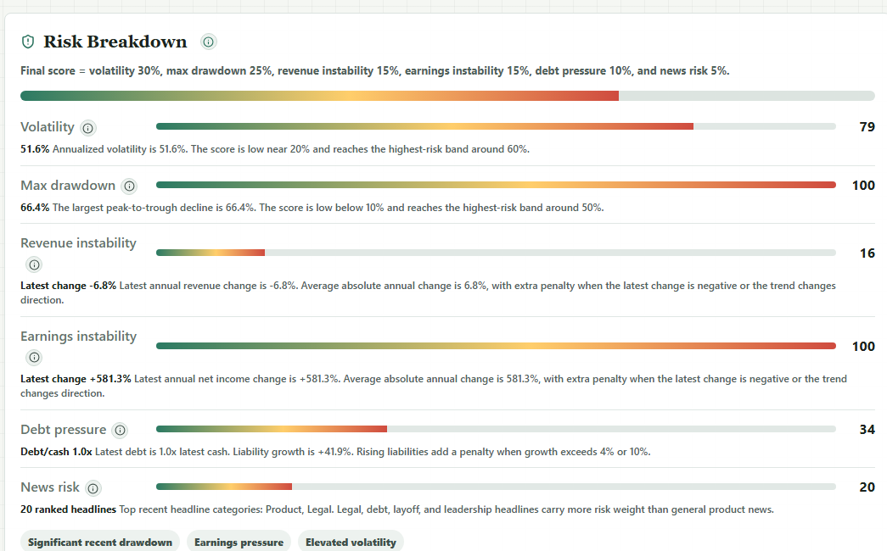
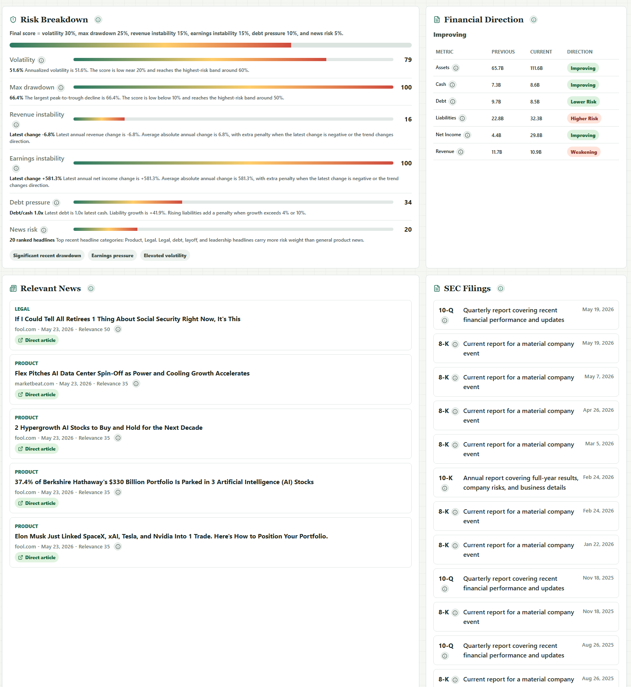
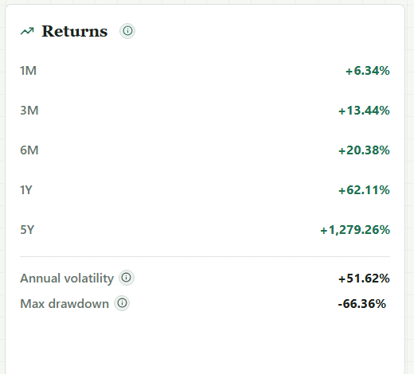
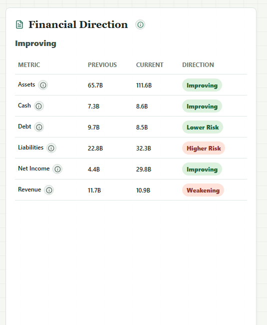
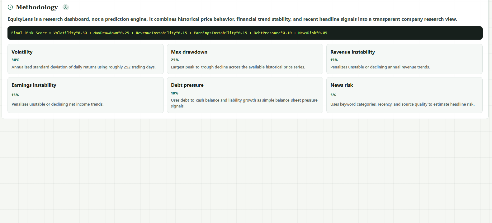

# EquityLens

[](https://github.com/AndreSanabria/EquityLens/actions/workflows/ci.yml)

EquityLens is a C#/.NET stock research dashboard that organizes price history, SEC filing data, financial direction, and relevant news into a structured company research view.

The project focuses on explainable research organization rather than trade recommendations or price forecasts. Calculations, source context, and data freshness are surfaced directly in the dashboard.

## Features

- Ticker search with a React dashboard UI
- Live historical price chart with selectable ranges: `1D`, `3D`, `1W`, `2W`, `4W`, `3M`, `6M`, `1Y`, and `5Y`
- Return calculations for `1M`, `3M`, `6M`, `1Y`, and `5Y`
- Annualized volatility and max drawdown analysis
- Transparent weighted risk score with component explanations and methodology panel
- SEC EDGAR company filings and financial facts
- Ranked relevant news with direct article links when live sources provide them
- Watchlist with notes and latest known risk score
- Research snapshots for saving prior dashboard results
- Provider/data freshness banner and clearer provider failure messages
- SQLite persistence for watchlist, snapshots, and API request logs
- Swagger/OpenAPI documentation for the backend

## Tech Stack

- C# / ASP.NET Core Web API
- Entity Framework Core
- SQLite
- Serilog
- Swagger / OpenAPI
- React
- TypeScript
- Vite
- xUnit
- Docker Compose
- SEC EDGAR APIs
- Yahoo Finance chart/RSS endpoints for local market-data retrieval

## Architecture

```text
EquityLens.sln
|-- src
|   |-- EquityLens.Api
|   |   |-- Configuration
|   |   |-- Controllers
|   |   |-- Data
|   |   |-- DTOs
|   |   |-- Models
|   |   |-- Services
|   |   `-- Utilities
|   `-- EquityLens.Web
|       |-- src
|       |-- public
|       `-- package.json
`-- tests
    `-- EquityLens.Api.Tests
```

Most of the project value is in the ASP.NET Core backend. React displays structured results returned by the API.

## Data Sources

EquityLens supports two provider modes:

- `Live`: pulls price history from Yahoo Finance chart data, recent headlines from Yahoo Finance RSS, and company facts/filings from SEC EDGAR.
- `Demo`: generates deterministic sample data for the supported example tickers so the application can run without network access.

The default mode is `Live`.

SEC requests require a descriptive user agent. Configure a contact string before running the API:

```powershell
$env:ApiProviderOptions__SecUserAgent="EquityLens contact@example.com"
```

For production use, replace the Yahoo Finance market-data adapter with a contracted market data provider such as Alpha Vantage, Twelve Data, Finnhub, Polygon, or another licensed source.

## Run Locally

Requirements:

- .NET 8 SDK
- Node.js 20+ recommended
- PowerShell on Windows

Start the API:

```powershell
dotnet restore
$env:ApiProviderOptions__SecUserAgent="EquityLens contact@example.com"
dotnet run --project .\src\EquityLens.Api --urls http://127.0.0.1:5077
```

Start the web app in a second terminal:

```powershell
cd .\src\EquityLens.Web
npm.cmd install
npm.cmd run build
npm.cmd run preview -- --host 127.0.0.1 --port 5173
```

Open the app:

```text
http://127.0.0.1:5173
```

Swagger is available at:

```text
http://127.0.0.1:5077/swagger
```

Note: if the project is stored in a folder containing `#`, Vite may warn about the path. The build/preview flow above is the most reliable local run path in that case.

## Run With Docker

```powershell
docker compose up --build
```

Then open:

```text
http://127.0.0.1:5173
```

The Docker setup runs:

- API on `http://127.0.0.1:5077`
- Web app on `http://127.0.0.1:5173`
- SQLite database in a named Docker volume

For public or deployed use, update `ApiProviderOptions__SecUserAgent` in `docker-compose.yml` to a real contact string.

## Build and Test

```powershell
dotnet build .\EquityLens.sln
dotnet test .\EquityLens.sln
cd .\src\EquityLens.Web
npm.cmd run build
```

## API Endpoints

- `GET /api/stocks/supported`
- `GET /api/stocks/{ticker}/dashboard`
- `GET /api/stocks/{ticker}/performance`
- `GET /api/stocks/{ticker}/risk`
- `GET /api/stocks/{ticker}/news`
- `GET /api/stocks/{ticker}/filings`
- `POST /api/stocks/{ticker}/snapshot`
- `GET /api/stocks/{ticker}/snapshots`
- `GET /api/watchlist`
- `POST /api/watchlist`
- `PUT /api/watchlist/{ticker}/notes`
- `DELETE /api/watchlist/{ticker}`
- `GET /api/methodology`

## Risk Methodology

The risk score is a transparent estimate based on historical price movement, financial trend stability, debt pressure, and recent news signals.

```text
Final Risk Score =
VolatilityScore * 0.30
+ MaxDrawdownScore * 0.25
+ RevenueInstabilityScore * 0.15
+ EarningsInstabilityScore * 0.15
+ DebtPressureScore * 0.10
+ NewsRiskScore * 0.05
```

Score labels:

- `0-25`: Low risk
- `26-50`: Moderate risk
- `51-75`: High risk
- `76-100`: Very high risk

More detail is documented in [docs/methodology.md](docs/methodology.md).

## Screenshots

### Dashboard



### Risk Breakdown



### Research Sections



### Returns



### Financial Direction



### Methodology



Screenshot inventory is documented in [docs/screenshots/README.md](docs/screenshots/README.md):

- Full dashboard
- Risk breakdown explanations
- Returns panel
- Financial direction panel
- Relevant news and SEC filings
- Methodology panel
- Watchlist and snapshots

## Known Limitations

- This app organizes research data; it does not recommend buying, selling, or holding a security.
- Yahoo Finance chart/RSS endpoints are used for local market-data retrieval and should not be treated as a production data license.
- Market cap is shown as `N/A` in live mode unless a licensed quote/fundamentals provider is added.
- SEC company facts can lag company events and depend on consistent XBRL tags across filings.
- News relevance is rule-based. It is explainable, but it can still miss context that a human analyst would catch.
